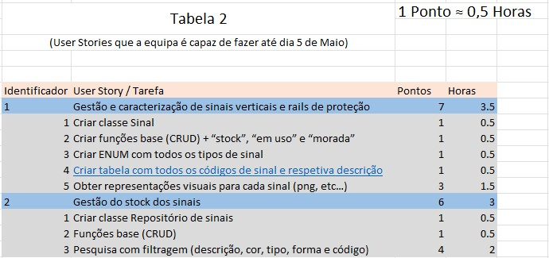

# MADS-Agile_Prog

## Trabalho Pequeno da Universidade sobre Programação Ágil

   

Todas as funcções abaixo foram implementadas:

##

   

Por fazer:
 

    -Testes Unitários á aplicação;
    -Bug Pequeno relacionado com as dimensões e posições das labels.
